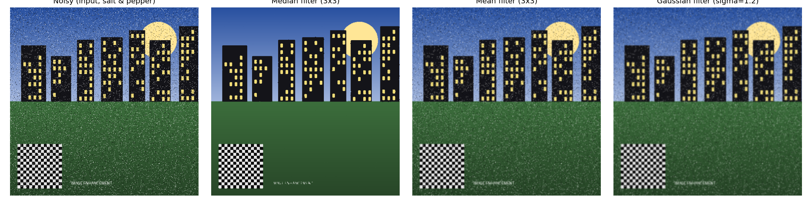

# Image Enhancement Based on Filtering

Implementation of spatial-domain and frequency-domain image enhancement
techniques — for dark, bright, low-contrast, blurred, and noisy images —
built for Google Colab, based on the course topic *"Image Enhancement
Based on Filtering"* (Wahyono, Ph.D., Universitas Gadjah Mada).

[](https://colab.research.google.com/github/<YOUR_USERNAME>/<YOUR_REPO>/blob/main/notebook/image_enhancement_colab.ipynb)

> Replace `<YOUR_USERNAME>/<YOUR_REPO>` above with your actual GitHub path
> after you push this repository — GitHub will then render a working
> "Open in Colab" button.

## What's inside

| Path | Contents |
|---|---|
| `notebook/image_enhancement_colab.ipynb` | **Main deliverable.** Self-contained Colab notebook: generates test images, implements every technique, shows all comparisons, and lets you upload your own photo for auto-enhancement. |
| `src/enhancement.py` | The enhancement library (importable Python module) — point processing, spatial filters, frequency-domain filters, metrics, auto-diagnosis. |
| `src/make_test_images.py` | Generates the synthetic base image and its 5 degraded variants. |
| `src/run_pipeline.py` | Runs the full pipeline as a plain script (no notebook needed) and regenerates everything in `images/output/` and `report/metrics.md`. |
| `images/input/` | The 5 synthetic degraded test images + the clean original. |
| `images/output/` | Enhanced results, side-by-side comparison figures, and Fourier-spectrum visualizations. |
| `report/REPORT.md` | **Full written analysis** (methodology, quantitative results, discussion, conclusion). |
| `report/metrics.md` | Machine-generated metrics table (RMS contrast / PSNR / entropy, before vs. after, for every method). |

## Problem categories covered

| Problem | Technique(s) implemented |
|---|---|
| Dark / underexposed | Gamma correction, Histogram Equalization |
| Bright / overexposed | Gamma correction, Contrast stretching |
| Low contrast | Contrast stretching, Histogram Equalization, CLAHE |
| Blurred | Unsharp masking, Laplacian sharpening, Frequency-domain high-pass boosting (Ideal / Gaussian / Butterworth) |
| Noisy (salt & pepper) | Median filter (compared against Mean & Gaussian filters) |
| *Any image (auto)* | `auto_enhance()` — diagnoses the defect and routes automatically |

Frequency-domain building blocks (2D FFT, Ideal/Gaussian/Butterworth
low-pass and high-pass filters, spectrum visualization) are implemented
from scratch in `src/enhancement.py`, following the DFT-based filtering
steps taught in the course.

## Quick start

### Option A — Google Colab (recommended, zero setup)
1. Upload this repository to GitHub.
2. Open `notebook/image_enhancement_colab.ipynb` in Colab (via the badge
   above, or File → Upload notebook).
3. `Runtime → Run all`. Everything — test-image generation, every
   enhancement technique, all comparison plots, and metrics — runs
   top-to-bottom with no external downloads required.
4. Optionally upload your own photo in Section 8 to try `auto_enhance()`
   on a real image.

### Option B — Run locally
```bash
git clone https://github.com/<YOUR_USERNAME>/<YOUR_REPO>.git
cd <YOUR_REPO>
pip install -r requirements.txt
cd src
python make_test_images.py   # generates images/input/*
python run_pipeline.py       # generates images/output/* and report/metrics.md
```

## Example result

Median filtering vs. linear smoothing on a salt-and-pepper–corrupted
image — median filtering removes the impulsive noise almost entirely while
preserving edges; mean/Gaussian filtering only smears it:



See `report/REPORT.md` for the full analysis with all five degradation
categories, quantitative metrics (PSNR / RMS contrast / entropy), and
discussion of trade-offs (e.g. histogram-equalization banding, ringing
from frequency-domain sharpening).

## Requirements

See `requirements.txt`. All libraries (`numpy`, `scipy`, `opencv-python`,
`matplotlib`, `pillow`) are pre-installed in Google Colab; the notebook's
setup cell also `pip install`s them explicitly for local/other-environment
use.

## License

MIT License — see `LICENSE`.
